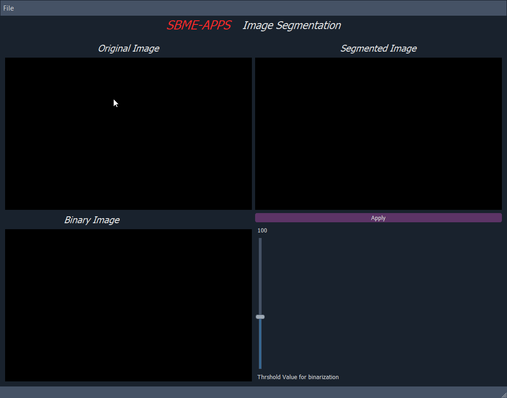

# Image segmentation
- [Features](#features)
- [Demos](#Demos)
    - [Image segmentation](#Image_segmentation)


-[Run-App](#Run-App)  

## Features
- Load images for segmenting background from the details in the image.
- Binarizing the image and Controlling the thershold of binarization.
- Applying mean shift segmentation alogorithm for segmentation. 

------
### Image_segmenting



---
## Run-App
 **_Run the application_**
```sh
python main.py
```


